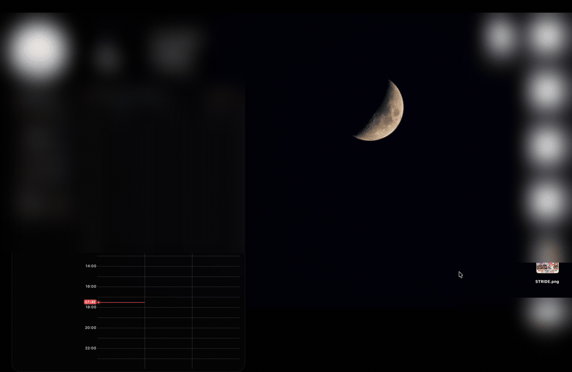

# DragShelf

**Drag files between windows and apps, at your own pace.**

**ウィンドウを切り替えるときも、ファイルの受け渡しをスムーズに。**

<p align="center">
  
</p>

[English](#english) · [日本語](#日本語)

## English

### A small shelf for easier drag and drop

DragShelf is a macOS utility for handing files from one window or app to another. It adds a place to set files aside while you prepare their destination.

When DragShelf detects a supported file drag, it reveals a compact shelf at your chosen screen corner or near the pointer. Drop your file onto it and let go of the mouse button. You can then bring another window forward, switch apps or Spaces, and find the destination without keeping a drag held down. When you are ready, drag the file from the shelf to where you need it.

Use it to keep a document handy while composing an attachment, prepare a file before opening an upload form, or gather files from different folders for later use. 

**Why it was built:** With the daily use of AI tools (ChatGPT, Claude, Cursor, Gemini, etc.), taking screenshots to give visual context and instructions has become a constant habit. DragShelf was created to make this frictionless—letting you instantly park freshly taken screenshots on a shelf, switch to your AI chat, and drop them right in without littering your desktop or losing your flow across multiple Spaces.

Parking stores a reference to the original file—not a new copy—and does not move or delete it.

### How to use it

1. Drag a local file or folder from Finder onto the shelf when it appears.
2. Release the mouse button and open the destination.
3. Drag the item from the shelf into a folder or an app that accepts files.

If the shelf does not appear automatically, you can show it manually from the menu-bar menu.

### Features

- **A shelf that appears during a file drag.** Choose any of the four screen corners or a position near the dragged file.
- **Files you can recognize at a glance.** Switch between list and icon views, with filenames, thumbnails where available, and file-icon fallbacks.
- **Quick Look without opening another app.** Click an item's thumbnail or name, keep the pointer over it, and press **Space**. Press Space again or **Esc** to close.
- **A shelf that remembers its contents.** File references survive an app restart. Choose a limit of 5, 10, 25, 50, or 100 entries (default: 25); the oldest references leave the shelf when the limit is exceeded.
- **Safe removal.** Each × removes only the shelf entry, never the original file. Removing the last entry hides the shelf.
- **An unobtrusive place on your desktop.** Adjust transparency from 0–60%. The shelf stays in front while it holds files.
- **Startup and icon choices.** Enable launch at login and independently show or hide the menu-bar and Dock icons.
- **English or Japanese.** The app starts in English. Choose **Language / 言語** in Settings to switch immediately; your choice is remembered after restarting. Native macOS dialogs follow your system language.

### Settings and parked files

The shelf's gear opens management. You can also open it from the menu-bar menu or by launching DragShelf from Applications—even when both icons are hidden.

Use **Settings** for appearance, placement, history size, startup, and permission controls. **Parked Items** lets you review and remove file references. The menu-bar menu also provides Show/Hide Shelf actions.

Settings groups related choices under **General**, **Shelf Appearance**, **History**, and **Drag Detection**. Detailed permission troubleshooting is available through **Help**.

The language selector updates Settings, the shelf, and the menu-bar menu without resetting parked files or other preferences. This feature is in the current source; the v0.1.6 release download does not include it yet.

### Install

Requirements: **macOS 14 or later**. The current v0.1.6 download is for **Apple Silicon (arm64)** Macs.

**Signing notice:** the app is ad-hoc signed, not Developer ID signed or notarized. Gatekeeper may block a downloaded copy. Review the source and release before deciding whether to allow it in **System Settings → Privacy & Security**. The Homebrew tap does not bypass Gatekeeper.

With the [dedicated Homebrew tap](https://github.com/nanonigit/homebrew-DragShelf):

```bash
brew tap nanonigit/dragshelf
brew install --cask dragshelf
```

Or download `DragShelf-0.1.6-macos-arm64.zip` from [GitHub Releases](https://github.com/nanonigit/DragShelf/releases), extract it, and put `DragShelf.app` in **Applications**.

### Permissions and current limitations

DragShelf currently accepts local files and folders. Arbitrary text, web URLs, non-file app content, clipboard recording, and promised downloads are not supported. It is not a backup or cloud drive: original files must remain available. Missing references remain listed as unavailable, and bookmarks may follow moved files but cannot guarantee recovery.

Automatic drag detection and receiving-app compatibility can vary. Full-screen and multi-display workflows still need broader hands-on testing.

DragShelf requests **Input Monitoring** at launch when it is not granted, to support drag detection. You control this permission in macOS; management shows the app's actual access check and active detection mode. An AppKit fallback may work without Input Monitoring. Manual shelf use remains available, and Quick Look needs no additional keyboard-monitoring permission.

Ad-hoc-signed updates can invalidate Input Monitoring access even when its switch still looks on. If management reports it as unavailable after an update, re-grant permission for the installed app in System Settings and restart DragShelf.

Launch at login starts the installed app quietly, without opening management. Its startup job has been tested in a running session, but a real logout/login still needs user confirmation. Before uninstalling, turn this option off in DragShelf.

For measured results and open checks—including cross-app drops, full-screen Spaces, multiple displays, and keyboard-focus return—see [verification.md](verification.md).

### Build from source

Requires Xcode/Swift with Swift Package Manager.

```bash
git clone https://github.com/nanonigit/DragShelf.git
cd DragShelf
swift test
bash script/build_and_run.sh --build-only
```

Copy the resulting `dist/DragShelf.app` to **Applications** and open it there. The build-only command does not restart an existing instance. Development and release procedures are in [design.md](design.md) and [verification.md](verification.md).

## 日本語

### ファイルの受け渡しに、小さな一時置きの棚を

DragShelf は、Mac のウィンドウやアプリの間でファイルを渡す操作を助けるユーティリティです。移動先を準備する間、ファイルを手元に置いておける棚を用意します。

対応するファイルのドラッグを検知すると、画面の四隅やカーソルの近くなど、指定した位置に小さな棚が現れます。そこへファイルを置けば、マウスのボタンを離せます。別のウィンドウを手前に出したり、アプリや Spaces を切り替えたりして、落ち着いて移動先を開いてください。準備ができたら、棚から目的の場所へドラッグして渡せます。

メールを書き始める前に添付する書類を置く。アップロード画面を開く前にファイルを用意する。別々のフォルダにあるファイルを集めておく。そんな場面で、棚がファイルの受け渡しの中継地点になります。

**開発のきっかけ（AIとのやり取りをスムーズに）:**  
ChatGPT や Claude、Cursor などの AI ツールを日常的に使うようになり、「画面のスクリーンショットを撮って AI に見せながら指示を出す」操作が激増しました。DragShelf はまさにその体験から生まれました。撮ったばかりのスクショをデスクトップに散らかすことなく棚にサッと一時退避し、別画面の AI チャットを開いてスムーズに放り込むことができます。

棚に保存するのは元ファイルへの参照だけで、置くときにファイル本体を複製・移動・削除することはありません。

### 基本の使い方

1. Finder からローカルのファイルやフォルダをドラッグし、現れた棚に置きます。
2. マウスのボタンを離し、移動先を開きます。
3. 棚から、ファイルを受け取れるフォルダやアプリへドラッグします。

棚が自動で現れない場合は、メニューバーのメニューから手動で表示できます。

### 主な機能

- **ドラッグ中に現れる棚。** 表示位置は画面の四隅、またはドラッグ中のファイルの近くから選べます。
- **置いたファイルを見分けやすく。** リスト／アイコン表示で名前を確認でき、生成可能な場合はサムネイル、それ以外はファイルのアイコンを表示します。
- **別のアプリを開かずにプレビュー。** サムネイルや名前をクリックし、カーソルをその上に置いて **スペースキー** を押すとクイックルックで確認できます。もう一度スペースキー、または **Esc** で閉じます。
- **再起動しても棚の内容を保持。** 保存件数は 5／10／25／50／100 件から選べ、初期値は 25 件です。上限を超えると古い参照から棚を外します。
- **元ファイルを消さずに片付ける。** × で取り外すのは棚の項目だけです。最後の項目を取り外すと棚が隠れます。
- **作業に合わせた見た目。** 透明度は 0〜60% で調整でき、ファイルが入っている間は棚が手前に表示されます。
- **起動とアイコン表示を選択。** ログイン時起動を設定でき、メニューバーと Dock のアイコンはそれぞれ表示・非表示にできます。
- **英語・日本語を切替。** 初期表示は英語です。「設定」の **Language / 言語** で切り替えると、その場で反映され、再起動後も選択を維持します。macOS標準のダイアログはシステムの言語に従います。

### 設定と、置いたファイルの管理

棚の歯車から管理画面を開けます。メニューバーのメニューや「アプリケーション」から DragShelf を起動する方法でも開けるため、両方のアイコンを隠していても設定に戻れます。

言語を変更すると、設定・棚・メニューバーの文言が切り替わります。一時置きしたファイルや他の設定は初期化しません。この機能は現行ソースに含まれますが、公開済みの v0.1.6 のダウンロードにはまだ含まれていません。

設定項目は「基本設定」「棚の表示」「履歴」「ドラッグ検知」にまとめています。入力監視の詳しいトラブル対処は「ヘルプ」から確認できます。

「設定」には見た目・表示位置・履歴件数・起動・権限の操作をまとめています。「一時置き」では、置いたファイルへの参照を確認・取り外しできます。メニューバーからは棚を表示・非表示にできます。

### インストール

動作環境は **macOS 14 以降**です。現在の v0.1.6 の配布バイナリは **Apple Silicon（arm64）Mac 用**です。

**署名について:** 配布版はアドホック署名のみで、Developer ID 署名・公証はありません。ダウンロードしたアプリは Gatekeeper に止められる場合があります。ソースと配布物を確認し、許可する場合は「システム設定 → プライバシーとセキュリティ」から操作してください。Homebrew tap は Gatekeeper を自動で回避しません。

[専用 Homebrew tap](https://github.com/nanonigit/homebrew-DragShelf) を使う場合:

```bash
brew tap nanonigit/dragshelf
brew install --cask dragshelf
```

または、[GitHub Releases](https://github.com/nanonigit/DragShelf/releases) から `DragShelf-0.1.6-macos-arm64.zip` を取得し、展開した `DragShelf.app` を **「アプリケーション」**へ置きます。

### 権限と、現在の制限

現在対応するのはローカルのファイルとフォルダです。任意のテキストや Web の URL、ファイル以外のアプリ内コンテンツ、クリップボードの自動記録、未完了のダウンロードなどには対応していません。バックアップやクラウドストレージではないため、元ファイルは引き続き必要です。見つからない参照は利用不可として残り、移動したファイルはブックマークで追跡できる場合がありますが、復元を保証するものではありません。

ドラッグの自動検知や受け渡し先との相性には差があり、フルスクリーンや複数ディスプレイでの利用は追加の実機検証が必要です。

ドラッグ検知のため、未許可の場合は起動時に **入力監視**の許可を求めます。許可は利用者自身が macOS で操作するもので、管理画面にはアプリ側の実際の判定と検知方式を表示します。入力監視なしでも AppKit による代替方式が動く場合があります。棚の手動操作は引き続き利用でき、クイックルックのための追加のキーボード監視権限は不要です。

アドホック署名版では、更新後に入力監視のスイッチが ON のままでも許可が失われる場合があります。管理画面で未許可になっているときは、システム設定でインストール済みアプリへの許可を設定し直し、DragShelf を再起動してください。

ログイン時起動では、インストール済みアプリを管理画面なしで起動します。起動ジョブは動作中のセッションで検証していますが、実際のログアウト／ログイン後の確認はまだ必要です。アンインストール前には、DragShelf のこの設定をオフにしてください。

アプリ間の受け渡し、フルスクリーン、複数ディスプレイ、棚から離れた際のキーフォーカスなど、検証済みの範囲と未確認の項目は [verification.md](verification.md) に記録しています。

### ソースからビルド

Swift Package Manager を使える Xcode／Swift が必要です。

```bash
git clone https://github.com/nanonigit/DragShelf.git
cd DragShelf
swift test
bash script/build_and_run.sh --build-only
```

生成された `dist/DragShelf.app` を **「アプリケーション」**へコピーし、そこから開きます。`--build-only` は動作中のアプリを再起動しません。開発・配布の手順は [design.md](design.md) と [verification.md](verification.md) を参照してください。

---

Development notes / 開発記録: [Requirements / 要件](requirements.md) · [Design / 設計](design.md) · [Tasks / 作業項目](tasks.md) · [Verification / 検証記録](verification.md)

License / ライセンス: [MIT](LICENSE).
